# Code Golf Party #1

A programming contest where participants try to solve problems with the smallest amount of code possible.

**Date:** Friday, August 26, 2022 @ 18:00 (+7:00) \
**Location:** [Copper Bar Bangkok](https://g.page/copper-bar-bangkok?share)

## About Code Golf Party

[**Code golf**](https://en.wikipedia.org/wiki/Code_golf) is a recreational programming activity where people find out what is the smallest possible source code to solve a certain problem.

**Code Golf Party,** organized by the [Creatorsgarten](https://creatorsgarten.org/) team, is an event where people meet up to play code golf, network with each other, and learn from each other.

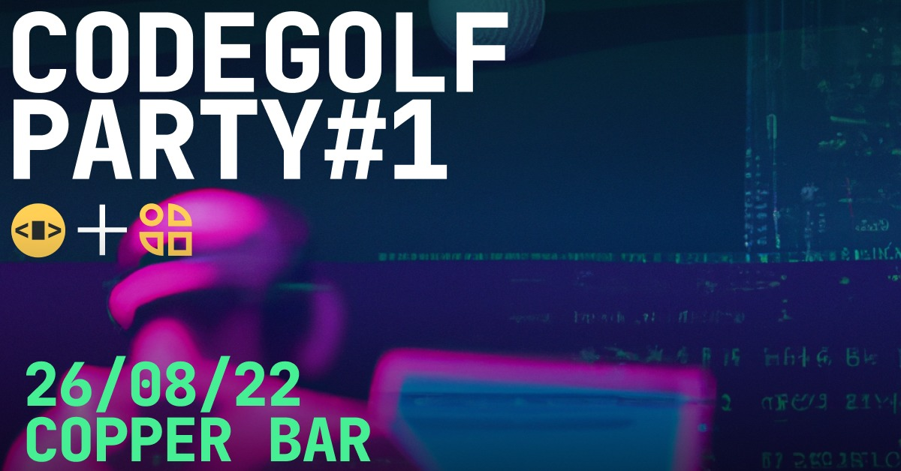

In each round, participants receive a programming problem and write a program that solves it. After the round ends, the solutions are then ranked by the number of characters in the source code. Then we look and learn from the solutions.

We assume that many programming languages will be represented, so we hope that the participants can learn about programming languages that they may not use often, and find useful ideas in other programming languages that they can apply to their work.

## Livestream recording

- [Part 1](https://www.facebook.com/showdown.space/videos/589192172698870/)
- [Part 2](https://www.facebook.com/showdown.space/videos/897540371212344/)

## Sponsors

<SponsorList />

## Application rounds

Due to the space constraints and safety concerns, only 60 people are allowed at the event.

With **over 200 applicants**, the application rounds are where the most intense code-golfing competition took place. (The actual event is more like a fun party than a serious competition.)

### Application round 1

Applicants were asked to write a program that displays the following output using the shortest code possible [(see full problem description)](https://hackmd.io/@dtinth/Hyk_qaAp5):

```
################
#::::::::::::::#
#::::::::::::::#
#::::::::::::::#
#::::::::::::::#
#::::::::::::::#
#::::::::::::::#
################
```

We awarded the party ticket to the top 10 applicants.

[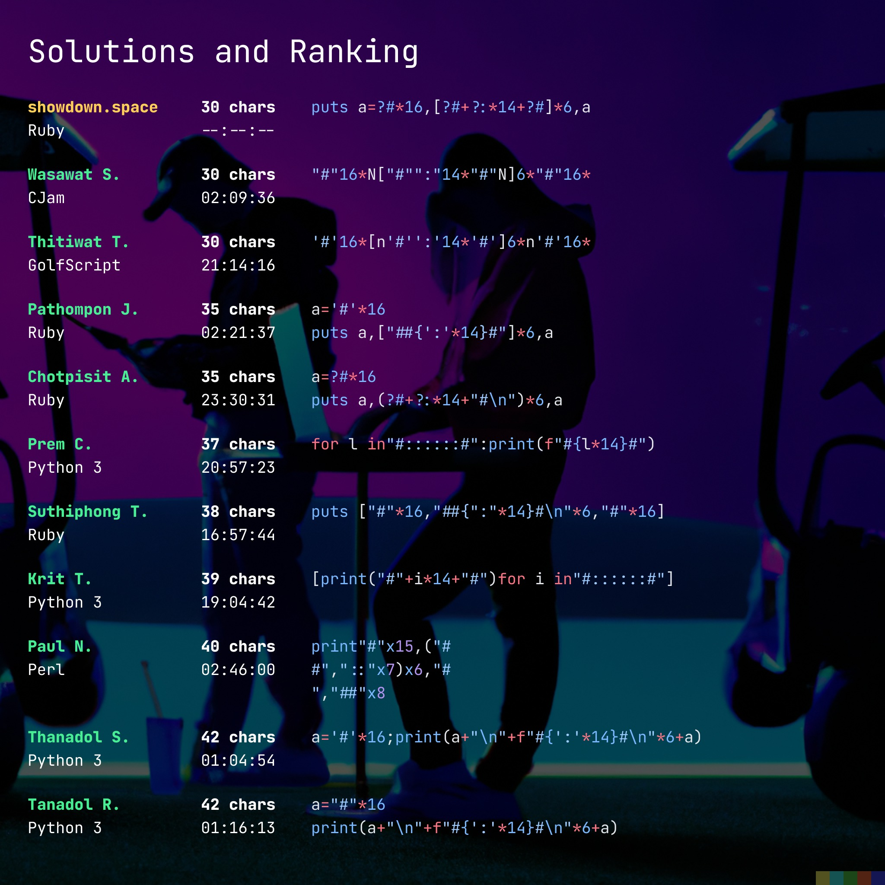](https://www.facebook.com/showdown.space/photos/pcb.146317008077184/146315598077325/)

There were over 200 applicants who submitted their solutions. Over half of all submissions were written in Python.

[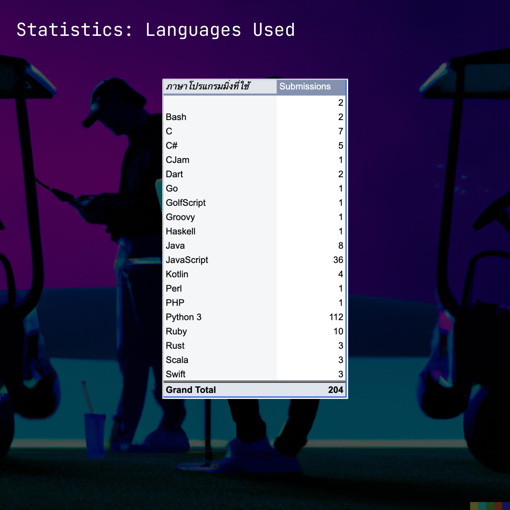](https://www.facebook.com/showdown.space/photos/pcb.146317008077184/146315558077329/)

We also awarded 8 extra tickets to applicants who wrote the shortest code in each programming language (1 submission per language).

[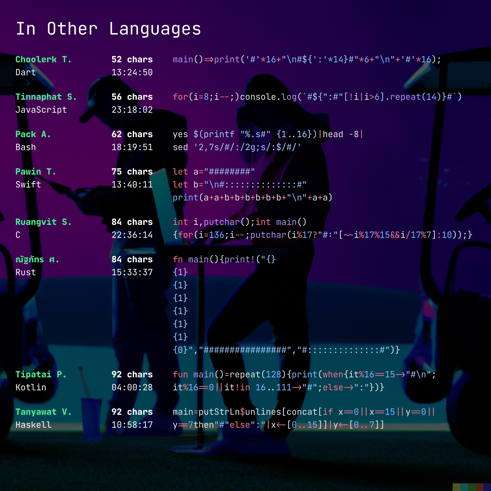](https://www.facebook.com/showdown.space/photos/pcb.146317008077184/146807091361509)

### Application round 2A

Applicants were asked to write a program that lists all the 84 possible paths in the following directed acyclic graph using the shortest code possible [(see full problem description)](https://hackmd.io/@dtinth/HkoBY7eAq):


Tickets were awarded to the top 7 applicants.

[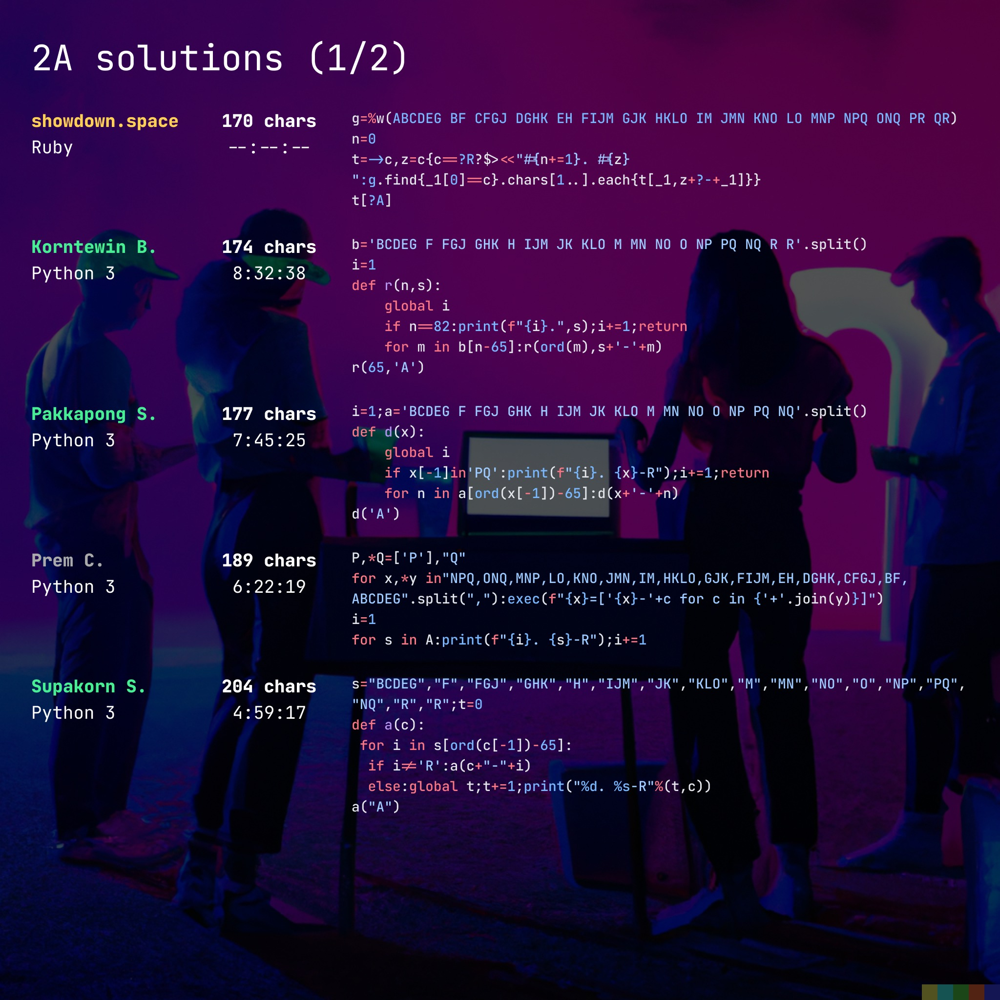](https://www.facebook.com/showdown.space/photos/pcb.147057831336435/147052718003613/)

[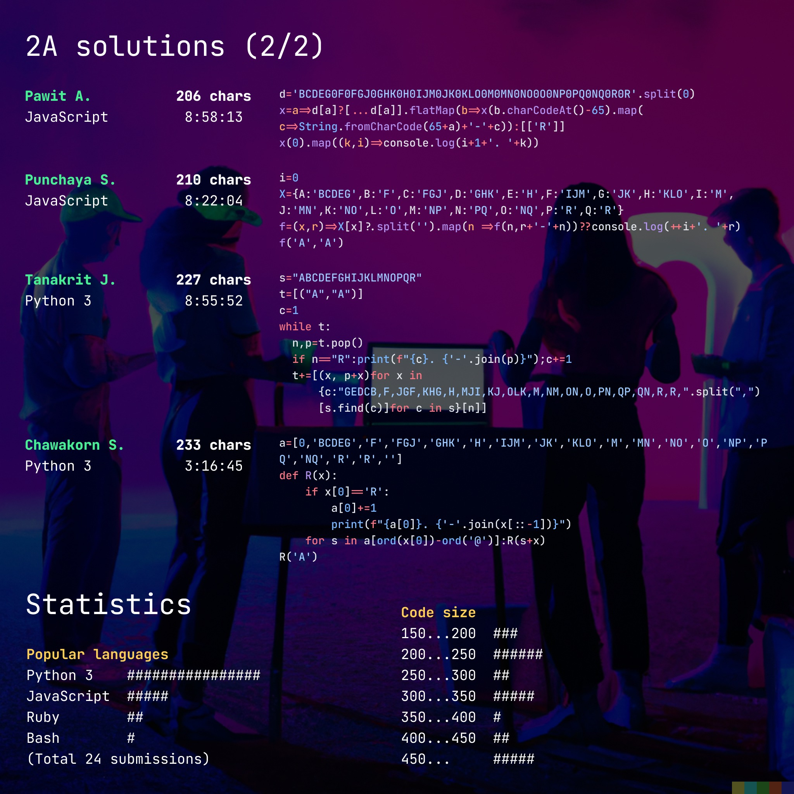](https://www.facebook.com/showdown.space/photos/pcb.147057831336435/147052734670278)

### Application round 2B

Applicants were asked to write a program that counts from 1 to 100 using the shortest code possible [(see full problem description)](https://hackmd.io/@dtinth/HkoBY7eAq).

Tickets were awarded to the top 5 applicants who wrote the shortest code in each programming language (1 submission per language).

[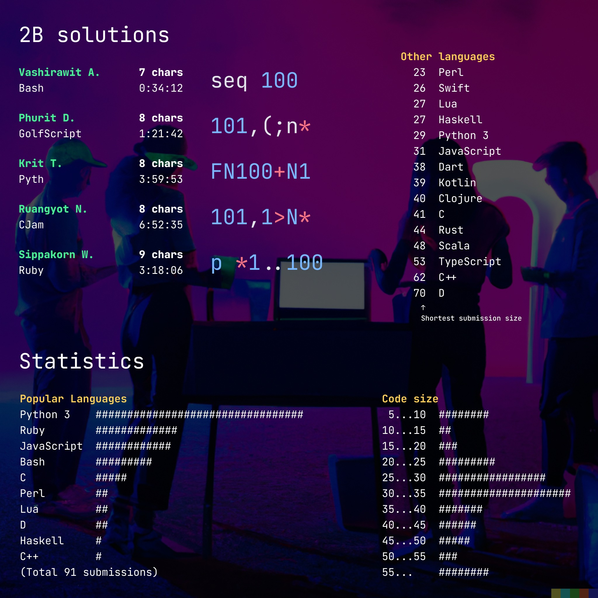](https://www.facebook.com/showdown.space/photos/pcb.147057831336435/147055868003298)

## At the event

At the event, we gather together at Copper Bar and play games of [CodinGame’s **Clash of Code**](https://www.codingame.com/multiplayer/clashofcode) in the **shortest mode**.

[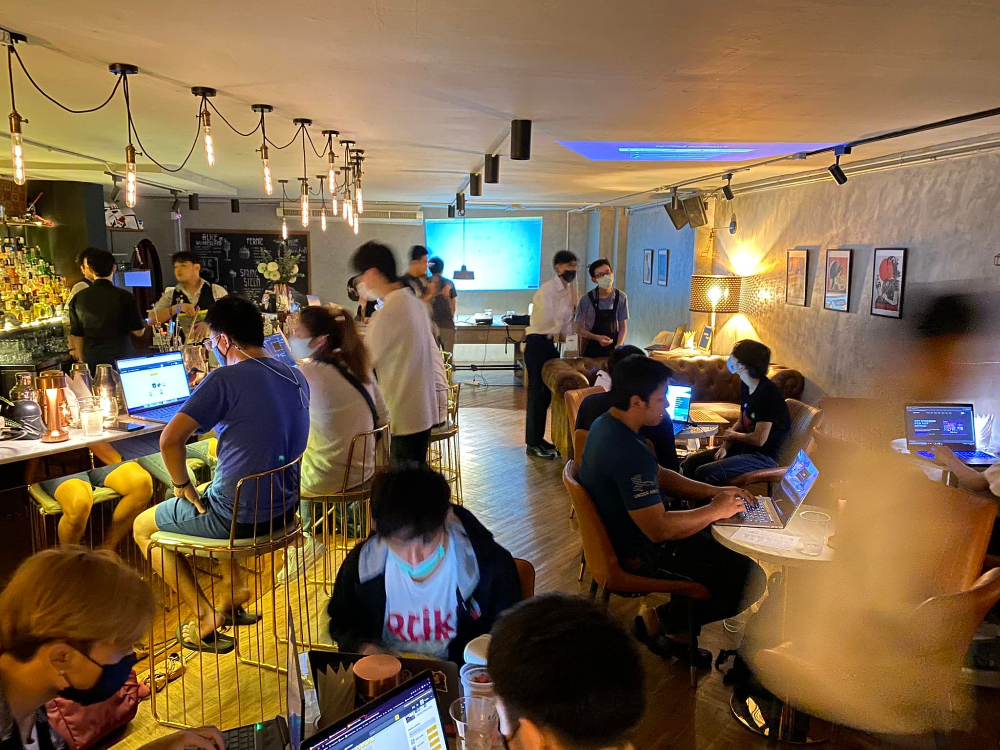](https://www.facebook.com/photo/?fbid=10221541993925729&set=a.1095604516845)

We designed the event to be more like a party where people meet up and play games together than a serious competition. We also want people to try and learn many different languages. So we made adjustment to the scoring system.

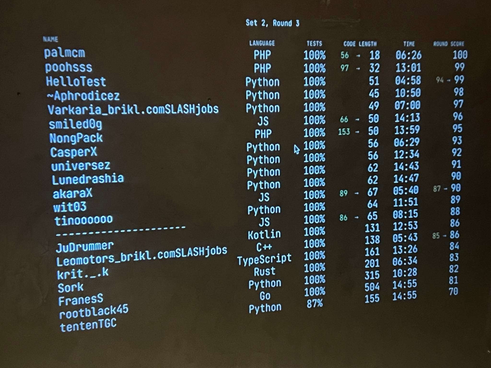

In some rounds, certain languages may be buffed up. For example, in the above picture, **PHP** gets the **0.33x multiplier**. That means 3 characters of PHP is counted as 1.

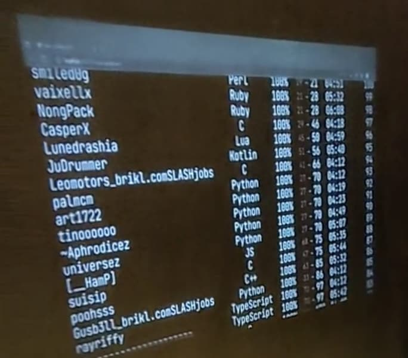

In another round, **languages are nerfed by how many people uses it in that round.** In the example image above, many people used Python, so the code length of Python gets multiplied by **2.6x**. This encourages people to try out different languages that that other people may not use.

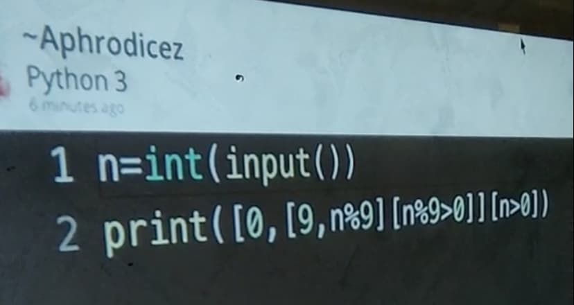

After each game, we look at top players and asked them to explain the code and code golfing techniques they used.

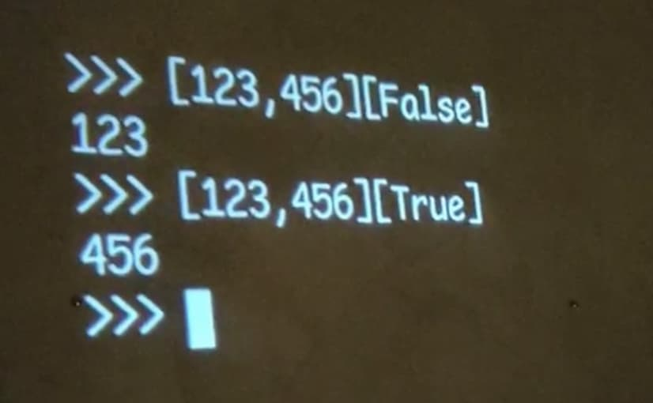

For example, we learned that, in Python, you can index into an array with `True` or `False`. This lets us select a result without having to use a conditional statement.


We also learned that in Perl, to read a line from standard input, you can just write `<>`.

### Scoring

We play **2 sets of games**. Each set has **3 rounds**.

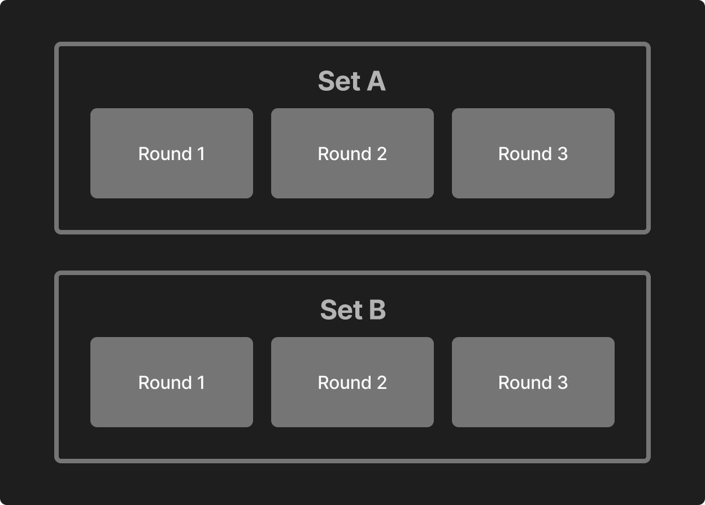

Generally, the person who submits the shortest code that passes all the test cases will win 100 points. The 2nd place gets 99 points. The 3rd place gets 98 points, and so on. There are modifiers that affects the scoring. These are explained in more details on the [Mechanics](https://showdownspace.page.link/golf1mechanics) document.

The scores from each round in the same set are summed up, and the best score between the 2 sets is used as the final score.

### Ranking

<RankingTable tableName="finals" />

## Staffs

- [Chayapatr Archiwaranguprok](https://creatorsgarten.org/)
- [Thai Pangsakulyanont](https://dt.in.th/)
- Nattpapat Pinyopusarerk
- [Phoomparin Mano](https://poom.dev/)
- [Manassarn Manoonchai](https://narze.live)
- [Jarukit Jintanasathirakul](https://wit03.xyz/)
- Pannawich Lohanimit
- [Siravij Praevisavakij](https://github.com/siravijbb)
- [Tanakorn Pisnupoomi](https://github.com/intaniger)
- [Phumrapee Limpianchop](https://rayriffy.com/)
- Chonlatee Jumratsee
- [Supratouch Suwatno](https://www.supratouch.dev/)

## Sponsor details

<SponsorDetails />
