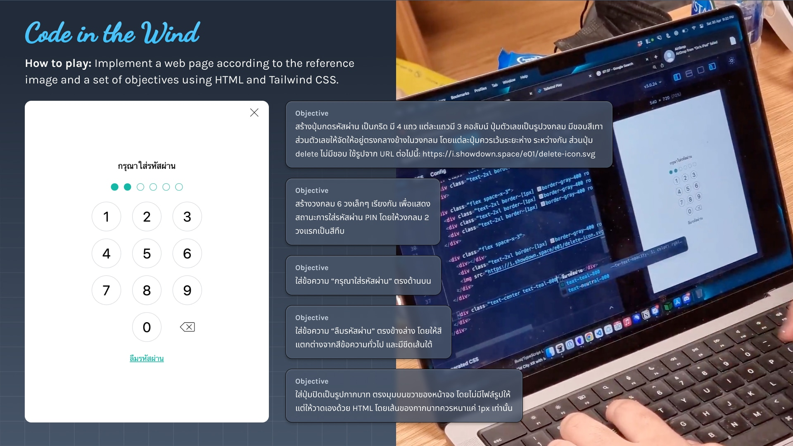

---
sponsors:
  - name: 'Cleverse'
    url: 'https://careers.cleverse.com/'
    image: 'https://user-images.githubusercontent.com/193136/167689309-13b590cd-d383-450d-996f-584a14737144.png'
    message: |
      Cleverse is a leading venture builder based in Thailand. We discover ideas to use technology to make the world a better place. The ideas are later validated, implemented, and measured. We are currently focusing on web3 space because we believe there are so many opportunities in web3 space. Also, we love Tailwind CSS! If you are a fan of Tailwind CSS or web3 and looking for a job opportunity, feel free to check our opening positions at <a target="_blank" rel="noopener" href="https://careers.cleverse.com/">https://careers.cleverse.com/</a>.
    links:
      - name: Main Site
        url: https://cleverse.com/
      - name: Careers
        url: https://careers.cleverse.com/
      - name: Blog
        url: https://medium.com/cleverse
  - name: 'Microsoft Thailand'
    url: 'https://aka.ms/CloudSkillsChallengeTH'
    image: 'https://user-images.githubusercontent.com/193136/167690035-3f63c7b4-6618-4f8a-bbec-ff8d25c46b7f.png'
    message: |
      Working with Tailwind CSS in Visual Studio Code? Let IntelliSense extension help you with advanced features such as autocomplete, syntax highlighting, and linting. → <a target="_blank" rel="noopener" href="https://github.com/tailwindlabs/tailwindcss-intellisense">https://github.com<wbr />/tailwindlabs<wbr />/tailwindcss-intellisense</a>
    links:
      - name: 'Thailand Cloud Skills Challenge'
        url: 'https://aka.ms/CloudSkillsChallengeTH'
      - name: 'Microsoft Virtual Hackathon 2022'
        url: 'https://aka.ms/APACHackFY22'
      - name: 'Web Development collection on Microsoft Learn'
        url: 'https://aka.ms/Learn-Web-Dev-TH'
      - name: 'Web Wednesday'
        url: 'https://docs.microsoft.com/en-us/shows/web-wednesday'
  - name: Brikl
    url: 'https://brikl.com/jobs'
    image: 'https://user-images.githubusercontent.com/193136/168313579-77f4d7bc-0132-4c9a-882a-e4d329c09c50.jpeg'
    message: |
      Brikl is the leading e-commerce platform for microstores worldwide, where promotional businesses start selling in 15 minutes. We're an international team with a strong engineering culture. We value developer experience, code quality and experimentation. We work in small cross-functional teams where you have full ownership of the product from start to finish. If you enjoy working with GraphQL, TypeScript and React, join us at <a target="_blank" rel="noopener" href="https://brikl.com/jobs">https://brikl.com/jobs</a>.
    links:
      - name: 'brikl.com/jobs'
        url: 'https://brikl.com/jobs'
      - name: 'Building Brikl'
        url: 'https://youtu.be/nPpzhMUJjPE'
      - name: 'Our Product'
        url: 'https://brikl.com'
  - name: Opn
    url: 'https://www.opn.ooo/en/'
    image: 'https://user-images.githubusercontent.com/193136/168275532-75544f12-5e40-4fd4-8669-b978889f7a8c.jpg'
    message: |
      We are Opn, a global company that provides fintech solutions and products to clients and users around the world. Our company name Opn (pronounced "open") captures the essence of what we believe in and stand for - a world where access to the digital economy is open for everyone. We aspire to facilitate all types of businesses in their adoption of cutting-edge financial technologies and connect our users through the Opn product ecosystem.
    links:
      - name: Opn Website
        url: 'https://www.opn.ooo/en/'
      - name: About Opn
        url: 'https://www.opn.ooo/en/about-us/'
      - name: Careers at Opn
        url: 'https://www.opn.ooo/en/careers/'
      - name: Apply to Opn Today
        url: 'https://forms.gle/bePFAdcr2RXWiZ4VA'
ranking:
  finals:
    - score: 85
      participant:
        handle: Varkaria
        handleUrl: https://github.com/Varkaria
        name: Pavaresorn Malai
    - score: 61
      participant:
        handle: GGolfz
        handleUrl: https://github.com/GGolfz
        name: GGolfz
    - score: 46
      participant:
        handle: msp5382
        handleUrl: https://github.com/msp5382
        name: p16w
    - score: 19
      participant:
        handle: Runyasak Ch.#7227
  semifinals1:
    - score: 91
      participant:
        handle: msp5382
        handleUrl: https://github.com/msp5382
        name: p16w
    - score: 70
      participant:
        handle: Runyasak Ch.#7227
    - score: 69
      participant:
        handle: rootEnginear
        handleUrl: https://github.com/rootEnginear
        name: Suthep Chanchuphol
    - score: 49
      participant:
        handle: phanuprat
        handleUrl: https://github.com/phanuprat
        name: Phanuprat Suwannachan
  semifinals2:
    - score: 61
      participant:
        handle: Varkaria
        handleUrl: https://github.com/Varkaria
        name: Pavaresorn Malai
    - score: 54
      participant:
        handle: GGolfz
        handleUrl: https://github.com/GGolfz
        name: GGolfz
    - score: 40
      participant:
        handle: rayriffy
        handleUrl: https://github.com/rayriffy
        name: Phumrapee Limpianchop
    - score: 34
      participant:
        handle: nitpum
        handleUrl: https://github.com/nitpum
        name: nitpum
participants:
  - handle: Basone01
    handleUrl: https://github.com/Basone01
    name: Surachet Sangasaeng
  - handle: Bearfinn
    handleUrl: https://github.com/Bearfinn
    name: Kritsada Sunthornwutthikrai
  - handle: betich
    handleUrl: https://github.com/betich
    name: thee
  - handle: bossoq
    handleUrl: https://github.com/bossoq
    name: Kittipos 'Pos' Wajakajornrit
  - handle: bytesbanana
    handleUrl: https://github.com/bytesbanana
    name: Saharat Paynok
  - handle: F9Uf
    handleUrl: https://github.com/F9Uf
    name: null
  - handle: fResult
    handleUrl: https://github.com/fResult
    name: fResult
  - handle: GGolfz
    handleUrl: https://github.com/GGolfz
    name: GGolfz
  - handle: Gusb3ll
    handleUrl: https://github.com/Gusb3ll
    name: Kitpipat Jaritwong
  - handle: icegotcha
    handleUrl: https://github.com/icegotcha
    name: Kotchakorn Wongwisutigul
  - handle: kittichonJr
    handleUrl: https://github.com/kittichonJr
    name: null
  - handle: Leomotors
    handleUrl: https://github.com/Leomotors
    name: Nutthapat Pongtanyavichai
  - handle: mikkipastel
    handleUrl: https://github.com/mikkipastel
    name: Monthira Chayabanjonglerd
  - handle: msp5382
    handleUrl: https://github.com/msp5382
    name: p16w
  - handle: nitpum
    handleUrl: https://github.com/nitpum
    name: nitpum
  - handle: NNICEEt
    handleUrl: https://github.com/NNICEEt
    name: Teerapat Nayapan
  - handle: phanuprat
    handleUrl: https://github.com/phanuprat
    name: Phanuprat Suwannachan
  - handle: rayriffy
    handleUrl: https://github.com/rayriffy
    name: Phumrapee Limpianchop
  - handle: rootEnginear
    handleUrl: https://github.com/rootEnginear
    name: Suthep Chanchuphol
  - handle: Runyasak Ch.#7227
  - handle: safepawin
    handleUrl: https://github.com/safepawin
    name: PawinDev
  - handle: SaltyAom
    handleUrl: https://github.com/SaltyAom
    name: SaltyAom
  - handle: tinarskii
    handleUrl: https://github.com/tinarskii
    name: Tinnaphat "Tin" Somsang
  - handle: Varkaria
    handleUrl: https://github.com/Varkaria
    name: Pavaresorn Malai
---

# Code in the Wind #1

A game show for Tailwind CSS users.

**Date:** Tuesday, May 17, 2022 @ 19:00 (+7:00) \
**Location:** [showdown.space Discord Server](https://discord.com/invite/d8zBzw2mem)

::: warning UNDER CONSTRUCTION
This page is a stub. For the latest news, check out the [Facebook event page](https://www.facebook.com/events/5398524660192656/).
:::

## About Code in the Wind

**Code in the Wind** is a game show where contestants implement a web page according to the reference screenshot and a set of objectives using [Tailwind CSS](https://tailwindcss.com/).

## Final ranking

### Final round

<RankingTable tableName="finals" />

### Semi-finals #1

<RankingTable tableName="semifinals1" />

### Semi-finals #2

<RankingTable tableName="semifinals2" />

## Sponsors

<SponsorList />

## Participants

<ParticipantsTable />

## Challenges

### Example challenge #1

- สร้างปุ่มกดรหัสผ่าน เป็นกริด มี 4 แถว แต่ละแถวมี 3 คอลัมน์
  - ประกอบไปด้วยปุ่มตามนี้: ((1, 2, 3), (4, 5, 6), (7, 8, 9), (0, delete))
  - ปุ่มตัวเลขเป็นรูปวงกลม มีขอบสีเทา ส่วนตัวเลขให้จัดให้อยู่ตรงกลางข้างในวงกลม โดยแต่ละปุ่มควรเว้นระยะห่างระหว่างกัน
  - ปุ่ม delete ไม่มีขอบ ใช้รูปจาก URL นี้ได้เลย [`https://i.showdown.space/e01/delete-icon.svg`](https://i.showdown.space/e01/delete-icon.svg)
- สร้างวงกลม 6 วงเล็กๆ เรียงกัน เพื่อแสดงสถานะการใส่รหัสผ่าน PIN
  - ให้วงกลม 2 วงแรกเป็นสีทึบ
- ใส่ข้อความ “กรุณาใส่รหัสผ่าน” ตรงด้านบน
- ใส่ข้อความ “ลืมรหัสผ่าน” ตรงข้างล่าง
  - เนื่องจากเป็นลิงค์ สีควรจะแตกต่างจากสีข้อความทั่วไป และมีขีดเส้นใต้
- ใส่ปุ่มปิดเป็นรูปกากบาท ตรงมุมบนขวาของหน้าจอ
  - ไม่มีรูปให้ ให้วาดเองด้วย HTML
  - เส้นของกากบาทควรหนาแค่ 1px เท่านั้น

### Example challenge #2

- ใส่ข้อความ _Game format_ ขนาดใหญ่ เป็นตัวหนา
- สร้างข้อความสามแถว สำหรับรอบ _Qualifiers_, _Semi-finals_ และ _Finals_ ตามรูป
  - Qualifiers มี 4 รอบ
  - Semi-finals มี 2 รอบ
  - Finals มีรอบเดียว
- ใต้ข้อความของแต่ละรอบ ใส่วงกลมตามจำนวนคนในรอบ
  - Qualifiers รอบละ 8 คน
  - Semi-finals กับ Finals รอบละ 4 คน
- ทำให้วงกลมเป็นเส้นประ ยกเว้นคนที่ผ่านเข้ารอบต่อไปหรืออยู่ในรอบ Finals ให้ทำเป็นเส้นทึบและมีพื้นหลังอ่อนๆ ตามรูป
- ทำเส้นเชื่อมจากรอบ Qualifiers → Semi-finals และ Semi-finals → Finals

### Solutions to example challenges

<iframe style="width: 100%; aspect-ratio: 16 / 9" src="https://www.youtube.com/embed/pLYjDuwZ-Ws" title="YouTube video player" frameborder="0" allow="accelerometer; autoplay; clipboard-write; encrypted-media; gyroscope; picture-in-picture" allowfullscreen></iframe>

<UnderConstruction>

### Qualifiers #1

name of

name of

name of

name of

name of

name of

name of

name of

### Qualifiers #2

### Qualifiers #3

### Qualifiers #4

### Semi-finals #1

### Semi-finals #2

### Finals #1

</UnderConstruction>

## Staffs

- [Thai Pangsakulyanont](https://dt.in.th/)
- Nattpapat Pinyopusarerk
- [Siriwat Kunaporn](https://siriwatk.dev/)
- [Kanisorn Sutham](https://heyfirst.co/)
- [Manassarn Manoonchai](https://narze.live/)
- Pakawat Anekwiroj
- Narawit Tubtimtoe

## Acknowledgements

This game is inspired by:

- [Code in the Dark](http://codeinthedark.com/)
- [DevWars.tv](https://www.devwars.tv/)

## Sponsor details

<SponsorDetails />
