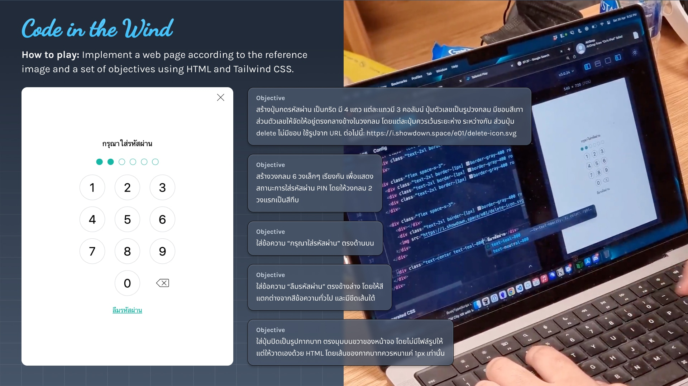

# Code in the Wind #2

**Code in the Wind #2** is a [BKK.JS #20 after-party](https://creatorsgarten.org/event/bkkjs20) where you can meet up, hang out, and participate in a friendly coding challenge using HTML, CSS, and Tailwind CSS.

**Date:** Saturday, May 18, 2024 @ 18:00 (+7:00) \
**Location:** [Agoda 8th fl., centralwOrld Offices](https://www.google.com/maps/search/?api=1&query=13.745939,100.538336) \
**Tickets:** [Eventpop](https://www.eventpop.me/e/26957) (a ticket is required to attend the event)

## About Code in the Wind

**Code in the Wind** is a game show where contestants implement a web page according to the reference screenshot and a set of objectives using [Tailwind CSS](https://tailwindcss.com/).

## Final ranking

### Final rounds

<RankingTable tableName="finals" />

[&rarr; See the final challenges](#finals-1-bento-grid)

## Sponsors

<SponsorList />

## Format

The game consists of 4 qualifying rounds and 2 final rounds.

- **Qualifying rounds:** 4 rounds with 6 contestants each. Top 2 contestants from each round advance to the final round.
- **Final rounds:** 2 rounds with 8 contestants each. The scores from the final rounds are combined to determine the final ranking.

## Challenges

The challenge in each round comes with

- A reference screenshot
- 5 objectives to meet

Completing each objective will earn you 15 points (for a total of 75 points). The remaining 25 points will be determined by viewers’ votes.

### Test round: Creatorsgarten logo

<Challenge url='https://citw02.pages.dev/challenges/06cafdce-6e4a-4b0b-a945-5ba3a93330d9/' referenceUrl='https://play.tailwindcss.com/jSymBDsYSu?size=540x720' videoUrl='https://youtu.be/9ftrgC60pPk'>

This challenge is for a test round. The goal is to recreate the Creatorsgarten logo using Tailwind CSS.

</Challenge>

### Qualifiers #1: Code 128

<Challenge url='https://citw02.pages.dev/challenges/128f918c-e1f2-44a7-a5c3-3c3208e527d1/' referenceUrl='https://play.tailwindcss.com/8G7Zu1X04j?size=540x720' videoUrl='https://youtu.be/-fAvIByango'>

This challenge focuses on attention to detail. The goal is to create a Code 128 barcode using Tailwind CSS that, when scanned, reveals the message "OK". Code 128 barcodes feature bars of four distinct widths. Participants must pay attention to the width of each bar and the spacing between them, and recreate it accurately.

</Challenge>

### Qualifiers #2: Glassmorphism

<Challenge url='https://citw02.pages.dev/challenges/2d74b0d1-69d2-4477-95ce-eaf72dde28ed/' referenceUrl='https://play.tailwindcss.com/rCrnCT9bUk?size=540x720' videoUrl='https://youtu.be/tbTZb-BQFJA'>

This challenge is about techniques for creating a glassmorphism effect, with background blur and a frosted glass appearance.

</Challenge>

### Qualifiers #3: the sun is a deadly lazer

<Challenge url='https://citw02.pages.dev/challenges/77ef7dcb-8274-4b75-8af5-3d11f473509f/' referenceUrl='https://play.tailwindcss.com/TW3nm05WMp?size=540x720' videoUrl='https://youtu.be/c7bV1rxXkXw'>

Inspired by [Bill Wurtz](https://www.youtube.com/watch?v=KdbI8BwrA1o), the goal of this challenge is to recreate Bill Wurtz’s text effect style using Tailwind CSS. This challenge focuses on overlapping text (absolute layout), transforms, shadows, and blend modes.

</Challenge>

### Qualifiers #4: Hotel recommendation

<Challenge url='https://citw02.pages.dev/challenges/ce1fc2ec-c83b-45fe-84fa-a3a2cf12256d/' referenceUrl='https://play.tailwindcss.com/dArBqJEGej?size=540x720' videoUrl='https://youtu.be/3dA1P7V1w3o'>

Inspired by [Agoda](https://www.agoda.com/), the goal of this challenge is to create a hotel recommendation card using Tailwind CSS. This challenge focuses on creating a layout with densely packed information in a limited time.

</Challenge>

### Finals #1: Bento Grid

<Challenge url='https://citw02.pages.dev/challenges/8b76f0ac-c6a2-4643-b5cd-d7b4773f8427/' referenceUrl='https://play.tailwindcss.com/eDsqwQqFNP?size=540x720' videoUrl='https://youtu.be/kWSnkcSAljQ'>

The goal of this challenge is to create a “bento grid” layout, as popularized by Apple’s presentations. This challenge focuses on creating a grid-like layout where some items are larger than others.

</Challenge>

### Finals #2: Imposter

<Challenge url='https://citw02.pages.dev/challenges/ff8b07ef-d1f3-4da4-b175-ac3ae55d8509/' referenceUrl='https://play.tailwindcss.com/Tmp8pDcaQZ?size=540x720' videoUrl='https://youtu.be/tzJcJPNvi9o'>

The goal of this challenge is to draw a character inspired by the game Among Us. This challenge focuses on creating a character without using any images, only HTML elements and Tailwind CSS.

</Challenge>

## Participants

<ParticipantsTable />

## Staffs

- [Thai Pangsakulyanont](https://dt.in.th/)
- [Phumrapee Limpianchop](https://rayriffy.com/)
- Chukkrit Visitsaktavorn
- GingGaew Patsalee
- Kanokphat Jinanarong
- [Manassarn Manoonchai](https://narze.live/)
- [Phoomparin Mano](https://poom.dev/)
- [Siravij Praevisavakij](https://siravijbb.com/)
- Suphatchari Laoprasert
- [Warat Wongmaneekit](https://thangman22.com/)

## Sponsor details

<SponsorDetails />

## Code

This event relies on many custom tools. The source code is available on GitHub.

- **The webapp:** The web app lets participants log in with their Creatorsgarten account. Once logged in, they can launch the editor which lets them work on the challenge. It also has a voting system where viewers can vote for their favorite submissions, a stage view that previews everyone’s submissions, as well as an admin interface for staff to manage the event. The source code is available in the [codeinthewind-editor-shell](https://github.com/showdownspace/codeinthewind-editor-shell) repository. It is built with [Remix](https://remix.run/) and uses [Firebase](https://firebase.google.com/) as the [backend](https://github.com/showdownspace/rt-sys).

- **The editor:** The editor used is a modified version of [Tailwind Play](https://play.tailwindcss.com/). The source code is available in the [codeinthewind-editor-core](https://github.com/showdownspace/codeinthewind-editor-core) repository. It implements a reverse proxy that injects [custom CSS and JavaScript](https://github.com/showdownspace/codeinthewind-editor-core/blob/main/public/codeinthewind.js) into the webapp. The injected code allows the editor to be controlled from the parent frame.

- **The challenge site:** This site hosts the challenges for the event. The source code is available in the [codeinthewind-02](https://github.com/showdownspace/codeinthewind-02) repository. It is built with [Eleventy](https://www.11ty.dev/).

- [tailwindcss-standalone](https://github.com/showdownspace/tailwindcss-standalone) bundles Tailwind CSS’ compiler in a way that can be used in a browser environment.
